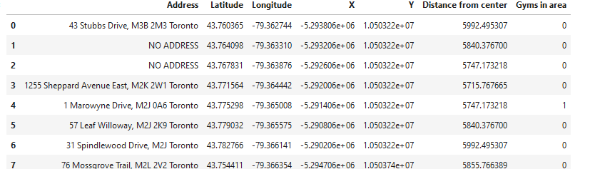
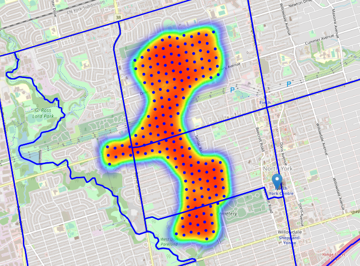
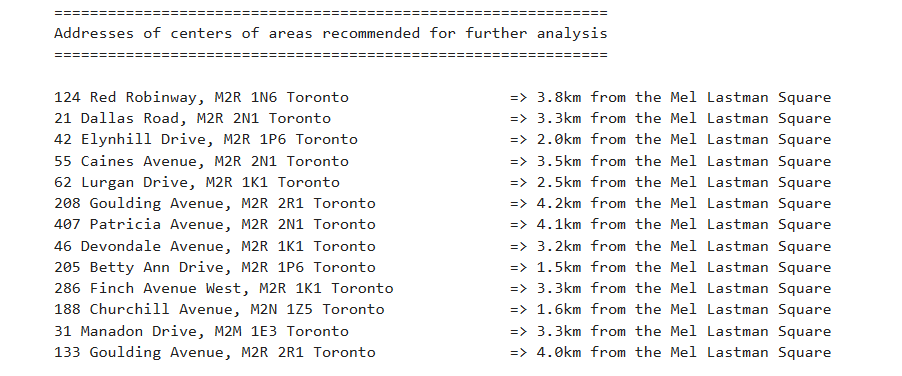

# Report - Find a location for a fitness studio in Toronto

## Table of contents
* [Introduction: Business Problem](#introduction)
* [Data](#data)
* [Methodology](#methodology)
* [Analysis](#analysis)
* [Results and Discussion](#results)
* [Conclusion](#conclusion)

## Introduction: Business Problem 

In this project we will try to find an optimal location for a fitness studio. 
Specifically, this report will be targeted to stakeholders interested in opening an **Gym / Fitness Club** in **Toronto (North York)**, Ontario.  
Since there are lots of Gym studios in North York we will try to detect **locations that are not already crowded with Gyms**. We are also particularly interested in **areas with no Gyms in vicinity**. We would also prefer locations **as close to city center as possible**, assuming that first two conditions are met, since it will have better access using public transportation.

We will use our data science powers to generate a few most promising neighborhoods based on this criteria.  
Advantages of each area will then be clearly expressed so that best possible final location can be chosen by stakeholders.

## Data 
Based on definition of our problem, factors that will influence our decision are:
* number of existing fitness studios in the neighborhood 
* number of and distance to fitness studios in the neighborhood, if any
* distance of neighborhood from city center

We decided to use regularly spaced grid of locations, centered around city center, to define our neighborhoods.

Following data sources will be needed to extract/generate the required information:
* centers of candidate areas will be generated algorithmically and approximate addresses of centers of those areas will be obtained using **reverse geocoding using built in Python function.**
* number of gyms and their type and location in every neighborhood will be obtained using **Foursquare API**
* coordinate of North York center will be obtained using **Python geocoding**

### Neighborhood Candidates

Let's create latitude & longitude coordinates for centroids of our candidate neighborhoods. We will create a grid of cells covering our area of interest which is aprox. 12x12 killometers centered around North York city center.

Let's first find the latitude & longitude of North York city center, using specific, well known address and Python geocoding API.

Let's get the geographical coordinates of Mel Lastman Square in North York.  
Mel Lastman Square is a public square at North York Civic Centre in Toronto, Ontario, Canada. It is named for former North York mayor (and later Toronto mayor) Mel Lastman.

Coordinate of Mel Lastman Square, North York, ON: [43.767633200000006, -79.4135172144644]  

Now let's create a grid of area candidates, equally spaced, centered around city center and within ~6km from Mel Lastman Square. Our neighborhoods will be defined as circular areas with a radius of 300 meters, so our neighborhood centers will be 600 meters apart.

To accurately calculate distances we need to create our grid of locations in Cartesian 2D coordinate system which allows us to calculate distances in meters (not in latitude/longitude degrees). Then we'll project those coordinates back to latitude/longitude degrees to be shown on Folium map. So let's create functions to convert between WGS84 spherical coordinate system (latitude/longitude degrees) and UTM Cartesian coordinate system (X/Y coordinates in meters).

Coordinate transformation check
-------------------------------
North York city centre longitude=-79.4135172144644, latitude=43.767633200000006  
North York city centre  UTM X=-5292005.8722601505, Y=10508936.99077959  
North York city centre  longitude=-79.41351721446487, latitude=43.767633199999786  

Let's create a hexagonal grid of cells: we offset every other row, and adjust vertical row spacing so that every cell center is equally distant from all it's neighbors.

**364 candidate neighborhood centers generated.**

Let's visualize the data we have so far: city center location and candidate neighborhood centers:

We now have the coordinates of centers of neighborhoods/areas to be evaluated, equally spaced (distance from every point to it's neighbors is exactly the same) and within ~6km from the Mel Lastman Square.

Let's now use OpenStreetMap API to get approximate addresses of those locations.

We now have the coordinates of centers of neighborhoods/areas to be evaluated, equally spaced (distance from every point to it's neighbors is exactly the same) and within ~6km from the Mel Lastman Square. 

Let's now use OpenStreetMap API to get approximate addresses of those locations.  
A few sample addresses:  
 * '2 Anndale Drive, M2N 5M5 Toronto'    
 * '110 Doris Avenue, M2N 0A8 Toronto' 
 * '63 Hillcrest Avenue, M2N 4T5 Toronto'  
 * '67 Parkview Avenue, M2N 3Y2 Toronto'    
 * '414 Kenneth Avenue, M2N 4G1 Toronto'    
 * '65 Olive Avenue, M2N 7N1 Toronto'  
 
 Let's create locations data table. Here is a segment of the table

### Foursquare
Now that we have our location candidates, let's use Foursquare API to get info on restaurants in each neighborhood.

We're interested in venues in 'Gym' category which is a subcategory in the bigger "Gym / Fitness Center" group. So we will include in out list only venues that have 'Gym' in category name, as we need info on Gyms in the neighborhood.

Category IDs corresponding to Gym/Fitness Clubs were taken from Foursquare web site (https://developer.foursquare.com/docs/resources/categories): '4bf58dd8d48988d175941735' 

* In total **106** Fitness venues were found in the North York 
* Average number of gyms in North York Neigbourhoods: 0.417

Let's now see all the collected Gyms in our area of interest on map: 

Looking good. So now we have all the gyms in area within few kilometers from Mel Lastman square! We also know which gyms are exactly are in vicinity of every neighborhood candidate center.

This concludes the data gathering phase - we're now ready to use this data for analysis to produce the report on optimal locations for a new gym!

## Methodology 

In this project we will direct our efforts on detecting areas of North York that have low gym density. We will limit our analysis to area ~6km around city center.

In first step we have collected the required **data: location and type (category) of every gym within 6km from North York center** (Mel Lastman Square). We have also **identified gym venues** (according to Foursquare categorization).

Second step in our analysis will be calculation and exploration of '**gym density**' across different areas of North York - we will use **heatmaps** to identify a few promising areas close to center with low number of gyms and focus our attention on those areas.

In third and final step we will focus on most promising areas and within those create **clusters of locations that meet some basic requirements** established in discussion with stakeholders: we will take into consideration locations with **no more than two gyms in radius of 300 meters**. We will present map of all such locations but also create clusters (using **k-means clustering**) of those locations to identify general zones / neighborhoods / addresses which should be a starting point for final 'street level' exploration and search for optimal venue location by stakeholders.

## Analysis 

Let's perform some basic explanatory data analysis and derive some additional info from our raw data. First let's count the **number of gyms in every area candidate**:  
Average number of gyms in every area with radius=300m: 0.41208791208791207

Let's add gyms nearby to our data table:  

  

We calculate **distance to nearest Gym from every area candidate center** (not only those within 1000m - we want distance to closest one, regardless of how distant it is). 

  
  
We calculate that average distance to closest gym from each area center: 971.9240171739833  
Let's crete a map showing **heatmap / density of gyms** and try to extract some meaningfull info from that. Also, let's show a few circles indicating distance of 1km, 2km and 3km from the Mel Lastman Square.

Toronto boroughs boundaries geojson definition: https://open.toronto.ca/dataset/neighbourhoods/

Looks like a few areas of low Fitness Clubs density closest to city center can be found **west from the Mel Lastman Square**. 
Also, looks like highest density of the gyms is along the Young Street and East Sheppard Avenue.

Based on this we will now focus our analysis on areas *north-west and west from North York center* - we will move the center of our area of interest and reduce it's size to have a radius of **2.5km**. This places our location candidates mostly in boroughs **Newtonbrook West and Willodale**.  

**Lansing-Westgale** is not as good candidate as the previous 2 areas - big part of it is actually a cemetery.
### Newtonbrook West and Willowdale

Analysis of popular web sites often mention Newtonbrook  and Willowdale as beautiful neighbourhoods with population with above average income so we can expect people to have disposable money to spend on "healthy life habits" trending now.

*"The average income in the area is above the average for Toronto and a majority of residents live in single detached or semi-detached houses, which they own."*  (https://en.wikipedia.org/wiki/Newtonbrook)

*Newtonbrook's population is growing at a steady rate and about 60% of the populate are age 24-64*  
(https://www.toronto.ca/ext/sdfa/Neighbourhood%20Profiles/pdf/2016/pdf1/cpa36.pdf)

*"The Willowdale neighbourhood consists of single-family homes, condominium townhouses and high-rise condominium towers."
(https://en.wikipedia.org/wiki/Willowdale,_Toronto)

*Willodale's population is growing at a steady rate and about 60% of the populate are age 24-64*  
https://www.toronto.ca/ext/sdfa/Neighbourhood%20Profiles/pdf/2016/pdf1/cpa37.pdf

With growing populatio and high percentage of working people in the target group of 24-64 years, relatively close to city center and well connected, those boroughs appear to justify further analysis.

Let's define new, more narrow region of interest, which will include low-restaurant-count parts of Newtonbrook West and Willodale closest to Mel Lastman Square.

Not bad - this nicely covers all the pockets of low gym density in Newtonbrook West and Willodale closest to Mel Lastman Square.

Let's also create new, more dense grid of location candidates restricted to our new region of interest (let's make our location candidates 200m appart) :  565 candidate neighborhood centers generated.

Now let's calculate two most important things for each location candidate: number of gyms in vicinity (we'll use radius of 250 meters) and distance to closest gym.

Let us now filter those locations: we're interested only in locations with **no more than one gym** in radius of **1000 meters**

Locations with no more than two gyms nearby: 527  
Locations with no gym / fitness club within 1000m: 176  
Locations with both conditions met: 176  

Let's see how this looks on a map:

We now have a bunch of locations fairly close to The Mel Lastman Square (mostly in Newtonbrook West and Willodale and central-east part of Bathurst Manorboroughs), and we know that each of those locations has no more than one gym in radius of 700m. Any of those locations is a potential candidate for a new gym , at least based on nearby competition.

Let's now show those good locations in a form of heatmap:

What we have now is a clear indication of zones with low number of gyms in vicinity.

Let us now cluster those locations to create centers of zones containing good locations. Those zones, their centers and addresses will be the final result of our analysis. 

Our clusters represent groupings of most of the candidate locations and cluster centers are placed nicely in the middle of the zones 'rich' with location candidates.

Addresses of those cluster centers will be a good starting point for exploring the neighborhoods to find the best possible location based on neighborhood specifics.

Let's see those zones on a city map without heatmap, using shaded areas to indicate our clusters:

Let's zoom in on candidate areas in Newtonbrook (Coordinate of Newtonbrook, North York, ON: [43.7938863, -79.42567902301055]):

...and candidate areas in **Willowdale** (Coordinate of Willowdale, North York, Toronto, ON: [43.7615095, -79.4109234]):

Finaly, let's reverse geocode those candidate area centers to get the addresses which can be presented to stakeholders.

This concludes our analysis. We have created 13 addresses representing centers of zones containing locations with low number of fitness clubs nearby, all zones being fairly close to city center (all less than 4.5 km from the Mel Lastman Square, and about quarter of those less than 2km from the Mel Lastman Square). Although zones are shown on map with a radius of ~500 meters (green circles), their shape is actually somewhat irregular and their centers/addresses should be considered only as a starting point for exploring area neighborhoods in search for potential gym locations. Most of the zones are located in Newtonbrook West and Willodale boroughs, which we have identified as interesting due to demographics, being fairly close to city center and well connected by public transport.
  

## Results and Discussion 
Our analysis shows that although there is a great number of fitness clubs in North York (106 in our initial area of interest which was 12x12km around Mel Lastman Square), there are pockets of low restaurant density fairly close to city center. Highest concentration of gyms was detected north and east from Mel Lastman Square along Young street and East Sheppard Avenue), so we focused our attention to areas west and north-west, corresponding to borough Newtonbrook and Willowdale. Another borough was identified as potentially interesting (Lansing-Westgale, south-west from Mel Lastman Square), but since big part of it is cemetery, our attention was focused on Newtonbrook and Willowdale which offer a combination of favourable demographic, closeness to city center, strong socio-economic dynamics *and* a number of pockets of gym density.

After directing our attention to this more narrow area of interest (covering approx. 5x5km south-east from Mel Lastman Square) we first created a dense grid of location candidates (spaced 100m appart); those locations were then filtered so that those with more than one gym in radius of 1000m  were removed.

Those location candidates were then clustered to create zones of interest which contain greatest number of location candidates. Addresses of centers of those zones were also generated using reverse geocoding to be used as markers/starting points for more detailed local analysis based on other factors.

Result of all this is 15 zones containing largest number of potential new gym locations based on number of and distance to existing venues.  
This, of course, does not imply that those zones are actually optimal locations for a new gym! Purpose of this analysis was to only provide info on areas close to North York center but not crowded with existing fitness clubs - it is entirely possible that there is a very good reason for small number of fitness facilities in any of those areas, reasons which would make them unsuitable for a new gym regardless of lack of competition in the area.  
Recommended zones should therefore be considered only as a starting point for more detailed analysis which could eventually result in location which has not only no nearby competition but also other factors taken into account and all other relevant conditions met.

## Conclusion 
Purpose of this project was to identify North York areas close to center with low number of gyms or fitness clubs in order to aid stakeholders in narrowing down the search for optimal location for a new gym. By calculating restaurant density distribution from Foursquare data we have first identified general boroughs that justify further analysis (Newtonbrook and Willowdale), and then generated extensive collection of locations which satisfy some basic requirements regarding existing nearby gyms. Clustering of those locations was then performed in order to create major zones of interest (containing greatest number of potential locations) and addresses of those zone centers were created to be used as starting points for final exploration by stakeholders.

Final decision on optimal fitness club location will be made by stakeholders based on specific characteristics of neighborhoods and locations in every recommended zone, taking into consideration additional factors like attractiveness of each location (proximity to park), proximity to major roads, real estate availability, prices, social and economic dynamics of every neighborhood etc.

