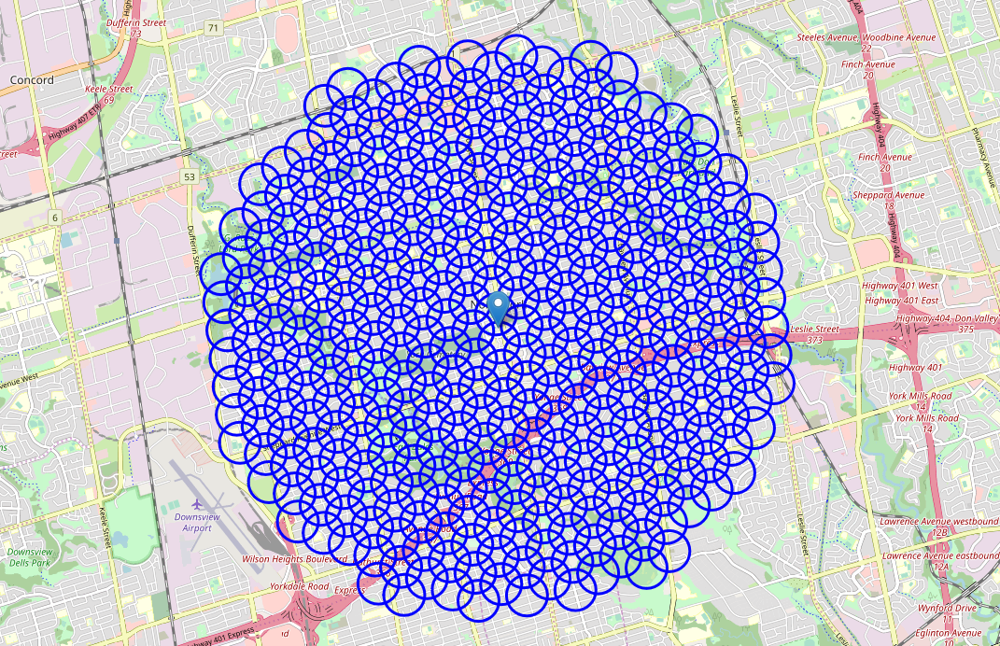

# Report - Find a location for a fitness studio in Toronto

## Table of contents
* [Introduction: Business Problem](#introduction)
* [Data](#data)
* [Methodology](#methodology)
* [Analysis](#analysis)
* [Results and Discussion](#results)
* [Conclusion](#conclusion)

## Introduction: Business Problem 

In this project we will try to find an optimal location for a fitness studio. 
Specifically, this report will be targeted to stakeholders interested in opening an **Gym / Fitness Club** in **Toronto (North York)**, Ontario.  
Since there are lots of Gym studios in North York we will try to detect **locations that are not already crowded with Gyms**. We are also particularly interested in **areas with no Gyms in vicinity**. We would also prefer locations **as close to city center as possible**, assuming that first two conditions are met, since it will have better access using public transportation.

We will use our data science powers to generate a few most promising neighborhoods based on this criteria.  
Advantages of each area will then be clearly expressed so that best possible final location can be chosen by stakeholders.

## Data 
Based on definition of our problem, factors that will influence our decision are:
* number of existing fitness studios in the neighborhood 
* number of and distance to fitness studios in the neighborhood, if any
* distance of neighborhood from city center

We decided to use regularly spaced grid of locations, centered around city center, to define our neighborhoods.

Following data sources will be needed to extract/generate the required information:
* centers of candidate areas will be generated algorithmically and approximate addresses of centers of those areas will be obtained using **reverse geocoding using built in Python function.**
* number of gyms and their type and location in every neighborhood will be obtained using **Foursquare API**
* coordinate of North York center will be obtained using **Python geocoding**

### Neighborhood Candidates

Let's create latitude & longitude coordinates for centroids of our candidate neighborhoods. We will create a grid of cells covering our area of interest which is aprox. 12x12 killometers centered around North York city center.

Let's first find the latitude & longitude of North York city center, using specific, well known address and Python geocoding API.

Let's get the geographical coordinates of Mel Lastman Square in North York.  
Mel Lastman Square is a public square at North York Civic Centre in Toronto, Ontario, Canada. It is named for former North York mayor (and later Toronto mayor) Mel Lastman.

Coordinate of Mel Lastman Square, North York, ON: [43.767633200000006, -79.4135172144644]  

Now let's create a grid of area candidates, equally spaced, centered around city center and within ~6km from Mel Lastman Square. Our neighborhoods will be defined as circular areas with a radius of 300 meters, so our neighborhood centers will be 600 meters apart.

To accurately calculate distances we need to create our grid of locations in Cartesian 2D coordinate system which allows us to calculate distances in meters (not in latitude/longitude degrees). Then we'll project those coordinates back to latitude/longitude degrees to be shown on Folium map. So let's create functions to convert between WGS84 spherical coordinate system (latitude/longitude degrees) and UTM Cartesian coordinate system (X/Y coordinates in meters).

Coordinate transformation check
-------------------------------
North York city centre longitude=-79.4135172144644, latitude=43.767633200000006  
North York city centre  UTM X=-5292005.8722601505, Y=10508936.99077959  
North York city centre  longitude=-79.41351721446487, latitude=43.767633199999786  

Let's create a hexagonal grid of cells: we offset every other row, and adjust vertical row spacing so that every cell center is equally distant from all it's neighbors.

**364 candidate neighborhood centers generated.**

Let's visualize the data we have so far: city center location and candidate neighborhood centers:

We now have the coordinates of centers of neighborhoods/areas to be evaluated, equally spaced (distance from every point to it's neighbors is exactly the same) and within ~6km from the Mel Lastman Square.

Let's now use OpenStreetMap API to get approximate addresses of those locations.

We now have the coordinates of centers of neighborhoods/areas to be evaluated, equally spaced (distance from every point to it's neighbors is exactly the same) and within ~6km from the Mel Lastman Square. 

Let's now use OpenStreetMap API to get approximate addresses of those locations.  
A few sample addresses:  
 * '2 Anndale Drive, M2N 5M5 Toronto'    
 * '110 Doris Avenue, M2N 0A8 Toronto' 
 * '63 Hillcrest Avenue, M2N 4T5 Toronto'  
 * '67 Parkview Avenue, M2N 3Y2 Toronto'    
 * '414 Kenneth Avenue, M2N 4G1 Toronto'    
 * '65 Olive Avenue, M2N 7N1 Toronto'  
 
 Let's create locations data table. Here is a segment of the table

### Foursquare
Now that we have our location candidates, let's use Foursquare API to get info on restaurants in each neighborhood.

We're interested in venues in 'Gym' category which is a subcategory in the bigger "Gym / Fitness Center" group. So we will include in out list only venues that have 'Gym' in category name, as we need info on Gyms in the neighborhood.

Category IDs corresponding to Gym/Fitness Clubs were taken from Foursquare web site (https://developer.foursquare.com/docs/resources/categories): '4bf58dd8d48988d175941735' 

* In total **106** Fitness venues were found in the North York 
* Average number of gyms in North York Neigbourhoods: 0.417

Let's now see all the collected Gyms in our area of interest on map: 

Looking good. So now we have all the gyms in area within few kilometers from Mel Lastman square! We also know which gyms are exactly are in vicinity of every neighborhood candidate center.

This concludes the data gathering phase - we're now ready to use this data for analysis to produce the report on optimal locations for a new gym!

## Methodology 

In this project we will direct our efforts on detecting areas of North York that have low gym density. We will limit our analysis to area ~6km around city center.

In first step we have collected the required **data: location and type (category) of every gym within 6km from North York center** (Mel Lastman Square). We have also **identified gym venues** (according to Foursquare categorization).

Second step in our analysis will be calculation and exploration of '**gym density**' across different areas of North York - we will use **heatmaps** to identify a few promising areas close to center with low number of gyms and focus our attention on those areas.

In third and final step we will focus on most promising areas and within those create **clusters of locations that meet some basic requirements** established in discussion with stakeholders: we will take into consideration locations with **no more than two gyms in radius of 300 meters**. We will present map of all such locations but also create clusters (using **k-means clustering**) of those locations to identify general zones / neighborhoods / addresses which should be a starting point for final 'street level' exploration and search for optimal venue location by stakeholders.

## Analysis 

Let's perform some basic explanatory data analysis and derive some additional info from our raw data. First let's count the **number of gyms in every area candidate**:  
Average number of gyms in every area with radius=300m: 0.41208791208791207

Let's add gyms nearby to our data table

